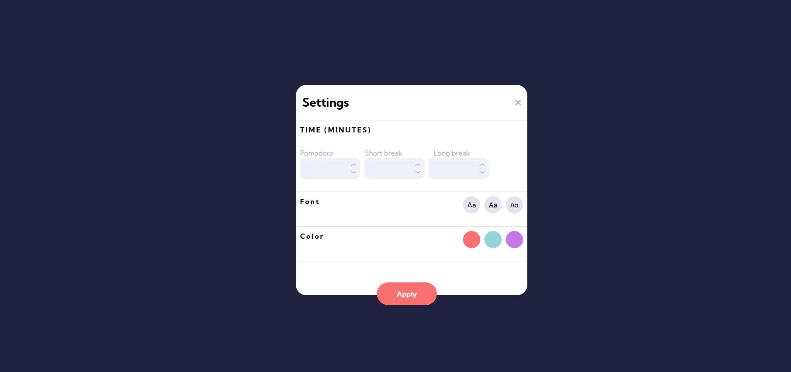

# ⏱️ Pomodoro Timer App

A simple and customizable Pomodoro timer built for productivity. This app helps you stay focused and manage your time efficiently by using the proven Pomodoro Technique.

---

## 🧠 What is the Pomodoro Technique?

The Pomodoro Technique is a time management method where you work in focused intervals (usually 25 minutes) followed by short breaks. After several cycles, you take a longer break. This app is designed to make that workflow seamless and easy to follow.

---

## 🛠️ Features

- ✅ Three Timer Modes:

  - **Pomodoro** – Focused work session
  - **Short Break** – A quick rest to recharge
  - **Long Break** – A deeper pause after several Pomodoros

- ⚙️ Fully Customizable Settings:

  - Set your **own durations** for:
    - Pomodoro
    - Short Break
    - Long Break
  - Choose a **custom interface color** to match your mood or workspace

- 🧭 Simple and distraction-free UI
- 🔁 Easy mode switching
- ⏳ Visual progress indication

---

## 📸 Screenshots




---

## 🚀 Getting Started

Clone the repo and install dependencies:

```bash
git clone https://github.com/your-username/pomodoro-app.git
cd pomodoro-app
npm install
npm start
```
